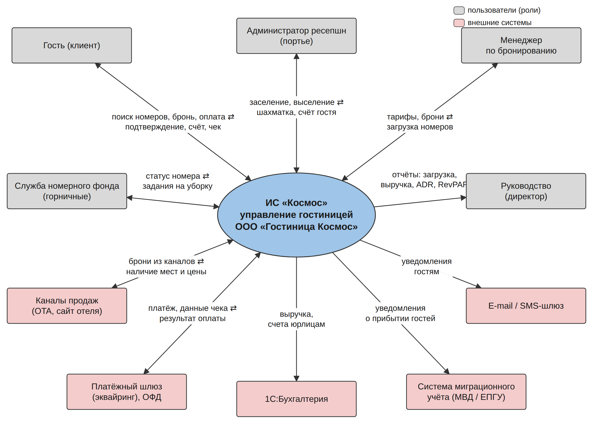

# panevina — практические работы: ИС «Космос» для ООО «Гостиница Космос»

Репозиторий с материалами практических работ №1–6. Проект — автоматизированная информационная система управления гостиницей **ИС «Космос»** (онлайн-бронирование, номерной фонд, заселение и выселение, расчёты, отчёты, интеграции).

| Работа | Тема | Файлы |
|---|---|---|
| ПР1–ПР2 | предыдущие работы | [ПР1](Практическая_работа_1) · [ПР2](Практическая_работа_2) |
| ПР3 | Спецификация требований к ПО | [СТПО](Практическая_работа_3/ПР3_Спецификация_требований_ИС_Космос.docx) |
| ПР4 | Общее назначение ИС, техническое задание (ГОСТ 34.602-2020) | [Общее назначение ИС](Практическая_работа_4/ПР4_1_Общее_назначение_ИС_Космос.docx) · [ТЗ (docx)](Практическая_работа_4/ПР4_2_ТЗ_ИС_Космос.docx) · [ТЗ (pdf)](Практическая_работа_4/ПР4_2_ТЗ_ИС_Космос.pdf) · [схемы](Практическая_работа_4/img) |
| ПР5 | Организация процесса разработки в Kaiten | [отчёт](Практическая_работа_5/ПР5_Отчет_Kaiten.docx) · [инструкция](Практическая_работа_5/ИНСТРУКЦИЯ_Kaiten.md) · [вложения карточек](Практическая_работа_5/материалы_для_карточек) |
| ПР6 | Организация репозитория в Git / GitHub | [отчёт](Практическая_работа_6/ПР6_Отчет_GitHub.docx) · [инструкция](Практическая_работа_6/ИНСТРУКЦИЯ_GitHub.md) · [файлы для веток](Практическая_работа_6/файлы_для_веток) |
| ПР7 | Описание для UML: классы, Use Case, Activity | [отчёт](Практическая_работа_7/ПР7_UML_классы_UseCase_Activity.docx) · [диаграммы](Практическая_работа_7/img) |
| ПР8 | Варианты использования (шаблон BABOK) | [отчёт](Практическая_работа_8/ПР8_Варианты_использования.docx) |
| ПР9 | Прототипирование страниц | [отчёт](Практическая_работа_9/ПР9_Прототипирование_страниц.docx) · [прототипы](Практическая_работа_9/img) |
| ПР10 | Архитектура: состояния, развёртывание, пакеты, кооперация, обзор взаимодействия | [отчёт](Практическая_работа_10/ПР10_Архитектура_UML.docx) · [диаграммы](Практическая_работа_10/img) |
| ПР11 | Тестовый сценарий и оценка количества тестов (вариант 24) | [отчёт](Практическая_работа_11/ПР11_Тестовый_сценарий_вариант24.docx) · [программа](Практическая_работа_11/программа) |
| СР5 | Динамическое поведение: диаграммы последовательности и состояний (вариант 3) | [отчёт](Самостоятельная_работа_5/СР5_Динамическое_поведение_вариант3.docx) · [диаграммы](Самостоятельная_работа_5/img) |

## Ветви репозитория

- `main` — утверждённые версии отчётов и документов;
- `docs` — проектная документация (ТЗ в PDF, диаграммы);
- `prototype` — прототип кода (модуль расчёта стоимости проживания и показателей загрузки на Python).

